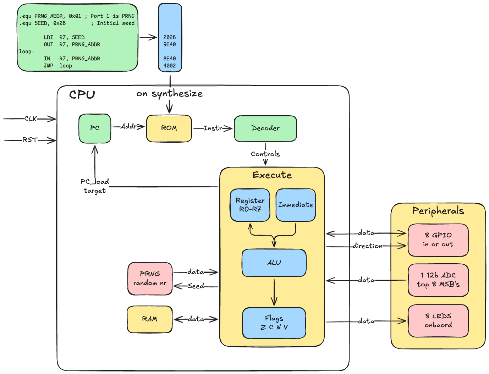

# 8-bit CPU in FPGA

Three things happened:
 - I wanted to see how 'good' LLM's are getting nowadays.
 - I was reading a blog about someone creating a basic CPU in C.
 - I wanted to do something with the MAX1000 FPGA I have laying around.

 > An FPGA (Field-Programmable Gate Array) is a chip whose internal logic circuitry can be reprogrammed after manufacturing — essentially a blank piece of hardware you configure with code.

 So I asked Claude Sonnet 4.6 via opencode the following:

 > Create an 8 Bit CPU with an ALU and 8 registers, start with the specification for the instruction set

 It then asked me a bunch of clarify-ing questions, such what memory model, which model of the chip exactly, wich programming language (VHDL or RTL)

 The result is here.

---

## Table of Contents

- [Architecture Overview](#architecture-overview)
- [Project Structure](#project-structure)
- [Simulation](#simulation)
- [Assembler](#assembler)
- [Synthesis and Programming the FPGA](#synthesis-and-programming-the-fpga)
- [Writing Your Own Programs](#writing-your-own-programs)
- [LED Indicators](#led-indicators)
- [OLED Debug Monitor](#oled-debug-monitor)
- [ISA Quick Reference](#isa-quick-reference)

---

## Architecture Overview

### CPU at a Glance

| Property | Value |
|----------|-------|
| Data width | 8 bits |
| Address width | 8 bits (256 locations) |
| Instruction width | 16 bits (fixed) |
| Registers | R0–R7 (8 × 8-bit, general purpose) |
| Architecture | Harvard (separate program ROM and data RAM) |
| Pipeline | 2-stage: Fetch → Execute |
| Stack | Hardware LIFO, 16 entries deep |
| Flags | Z (zero), C (carry), N (negative), V (overflow) |
| Clock | 12 MHz on-board oscillator |

### Block Diagram


### Pipeline

The CPU uses a simple 2-stage pipeline to hide the 1-cycle ROM read latency:

```
Cycle N:    PC → ROM address
Cycle N+1:  ROM output valid → decode → execute → write-back
```

A 1-cycle flush NOP is inserted automatically after every taken branch or jump. A HALT instruction freezes the PC and replaces all subsequent ROM output with NOPs permanently.

### Modules

| File | Description |
|------|-------------|
| [rtl/cpu.v](rtl/cpu.v) | Top-level CPU — wires all modules together |
| [rtl/decoder.v](rtl/decoder.v) | Instruction decoder / control unit |
| [rtl/alu.v](rtl/alu.v) | 8-bit ALU (ADD SUB AND OR XOR NOT SHL SHR) |
| [rtl/regfile.v](rtl/regfile.v) | 8 × 8-bit register file |
| [rtl/pc.v](rtl/pc.v) | 8-bit program counter with load and halt |
| [rtl/rom.v](rtl/rom.v) | 256 × 16-bit synchronous program ROM |
| [rtl/ram.v](rtl/ram.v) | 256 × 8-bit data RAM |
| [rtl/stack.v](rtl/stack.v) | 16-entry hardware stack (PUSH/POP/CALL/RET) |
| [rtl/prng.v](rtl/prng.v) | 8-bit Galois LFSR hardware PRNG (period 255, tap mask 0xB8) |
| [rtl/oled_monitor.v](rtl/oled_monitor.v) | SSD1306 OLED debug monitor — SPI driver + font ROM + display FSM |
| [rtl/input_barrier.v](rtl/input_barrier.v) | Synthesis black-box register barrier (prevents Quartus ACE optimisation through oled_monitor) |
| [rtl/top.v](rtl/top.v) | MAX1000 top-level (clock, reset, LED/GPIO/ADC logic) |

---

## Examples

| Program | Tests | Explanation |
| ------- | ------| ----------- |
| [examples/infinite_counter.asm](examples/infinite_counter.asm) | Registers, loops| counts from 0 to 63 then starts again |
| [examples/led_test.asm](examples/led_test.asm) | LEDs| counts from 0-255 and writes each value to the LEDs via `OUT Ra, 2`|
| [examples/pc_test.asm](examples/pc_test.asm) | Program counter | executes 32 NOP (nothing operator) to test the program counter |
| [examples/count_to_9.asm](examples/count_to_9.asm) | Registers, loops | counts from 0 to 9 in R0 repeatedly |
| [examples/fibonacci.asm](examples/fibonacci.asm) | RAM, Registers | Calculates fibonacci numbers that fit in 8bits, stores in RAM and outputs the result to the LEDs |
| [examples/fibonacci_stack.asm](examples/fibonacci_stack.asm) | Stack | same as above but uses the stack to store the numbers |
| [examples/knightrider.asm](examples/knightrider.asm) | Shift left/right | Display the knightrider pattern on the leds via `OUT Ra, 2` |
| [examples/flag_test.asm](examples/flag_test.asm) | Flags (Z, C, N, V) | Exercises all four flags |
| [examples/prng.asm](examples/prng.asm) | IN instruction, PRNG | Uses the `IN` instruction to read the hardware Galois LFSR; streams pseudo-random values to the LEDs via `OUT Ra, 2` (period 255) |
| [examples/adc.asm](examples/adc.asm) | IN instruction, ADC | Reads the MAX10 internal ADC on ANAIN (PIN_D2) via `IN R0, 3` and streams the 8-bit sampled value to the LEDs via `OUT R0, 2` |

---

## Simulation

### Requirements

- [Icarus Verilog](https://steveicarus.github.io/iverilog/) (`iverilog` + `vvp`)

### Running all testbenches

All commands are run from the **project root**.

```sh
# ALU
iverilog -g2005 -o sim/tb_alu tb/tb_alu.v rtl/alu.v && vvp sim/tb_alu

# Register file
iverilog -g2005 -o sim/tb_regfile tb/tb_regfile.v rtl/regfile.v && vvp sim/tb_regfile

# Program counter
iverilog -g2005 -o sim/tb_pc tb/tb_pc.v rtl/pc.v && vvp sim/tb_pc

# Instruction decoder
iverilog -g2005 -o sim/tb_decoder tb/tb_decoder.v rtl/decoder.v && vvp sim/tb_decoder

# ROM + RAM
iverilog -g2005 -o sim/tb_mem tb/tb_mem.v rtl/rom.v rtl/ram.v && vvp sim/tb_mem

# Stack
iverilog -g2005 -o sim/tb_stack tb/tb_stack.v rtl/stack.v && vvp sim/tb_stack

# CPU integration (runs cpu_program.hex)
iverilog -g2005 -o sim/tb_cpu \
    tb/tb_cpu.v rtl/cpu.v rtl/rom.v rtl/ram.v \
    rtl/regfile.v rtl/alu.v rtl/pc.v rtl/decoder.v rtl/stack.v rtl/prng.v

vvp sim/tb_cpu
```

The testbench checks that `halt_out` is asserted and inspects register values via hierarchical access. Edit `tb/tb_cpu.v` to add your own assertions for your program's expected final state.

### Step 4 — Run on the FPGA

```sh
cp examples/count_to_9.hex program.hex
```

Then recompile in Quartus and reprogram the board as described above. The LEDs will immediately reflect the new program's execution.

> **Note:** The LEDs show whatever value was last written by `OUT Ra, 2`. If the program never executes that instruction the LEDs remain off.

---

## LED Indicators

The 8 onboard LEDs are controlled directly by the CPU via the `OUT Ra, 2` instruction.
`LED[0]` shows the MSB (bit 7) of Ra and `LED[7]` shows the LSB (bit 0).

| LED | Pin | Ra bit |
|-----|-----|--------|
| LED[0] | A8  | Ra[7] (MSB) |
| LED[1] | A9  | Ra[6] |
| LED[2] | A11 | Ra[5] |
| LED[3] | A10 | Ra[4] |
| LED[4] | B10 | Ra[3] |
| LED[5] | C9  | Ra[2] |
| LED[6] | C10 | Ra[1] |
| LED[7] | D8  | Ra[0] (LSB) |

LEDs are **active-low** on the MAX1000 — `led=0` illuminates the LED.

The LED register resets to `0x00` (all off) on CPU reset. The LEDs hold their last written value until the next `OUT Ra, 2` instruction.

---

## OLED Debug Monitor

A Digilent [PmodOLED](https://digilent.com/reference/pmod/pmodoled/start) (128×32 SSD1306, SPI) connected to the MAX1000 PMOD header continuously displays live CPU state at ~11 Hz.

### Display layout

```
C R0-R3:  XX XX XX XX    ← flag C  + R0..R3 in hex
Z R4-R7:  XX XX XX XX    ← flag Z  + R4..R7 in hex
N PC: XXXXH ST: XX       ← flag N  + PC (4 hex digits) + H if halted + stack depth (2 hex digits)
V <PROGRAM NAME>         ← flag V  + up to 19-char program name (injected at synthesis)
```

### PMOD wiring (MAX1000 PMOD header → PmodOLED)

| PMOD Pin | MAX1000 Pin | PmodOLED Signal |
|----------|-------------|-----------------|
| 1  | PIN_M3 | CS (SPI chip select, active low) |
| 2  | PIN_L3 | SDIN (SPI MOSI) |
| 4  | PIN_M1 | SCLK (SPI clock, 6 MHz) |
| 7  | PIN_N3 | D/C (Data=1 / Command=0) |
| 8  | PIN_N2 | RES (Reset, active low) |
| 9  | PIN_K2 | VBATC (display panel power, active low) |
| 10 | PIN_K1 | VDDC (logic power, active low) |

### Synthesis note — ACE optimisation workaround

For simple programs whose register values are fully predictable at compile time (e.g. `infinite_counter`, where R0 counts 0–63 and R1–R7 are constant), Quartus performs global constant-propagation and then applies **Auto Clock Enable (ACE)** optimisation: it derives a CE signal from a proven-constant register bit and gates the input pipeline flip-flops with it — so they never load, and the font lookup chain is constant-folded to `0x00`, producing a blank display.

The fix is `rtl/input_barrier.v`, a small registered module declared as `/* synthesis black_box */`. Quartus treats black-box outputs as completely unknown, which prevents both constant-propagation and ACE optimisation from reaching `oled_monitor`.

---

## ISA Quick Reference

All instructions are **16 bits** wide. Three formats are used:

```
R-format:  [15:12] group | [11:9] Rd  | [8:6] Ra | [5:3] Rb  | [2:0] sub
I-format:  [15:12] group | [11:9] Rd  | [8:6] Ra | [5:0] imm6
I8-format: [15:12] group | [11:9] sub | [8] x    | [7:0] imm8
```

### Instruction table

| Instruction | Format | Encoding | Operation | Flags |
|---|---|---|---|---|
| `ADD  Rd, Ra, Rb`   | R  | `0000 ddd aaa bbb 000` | Rd = Ra + Rb        | Z C N V |
| `SUB  Rd, Ra, Rb`   | R  | `0000 ddd aaa bbb 001` | Rd = Ra − Rb        | Z C N V |
| `AND  Rd, Ra, Rb`   | R  | `0000 ddd aaa bbb 010` | Rd = Ra & Rb        | Z N     |
| `OR   Rd, Ra, Rb`   | R  | `0000 ddd aaa bbb 011` | Rd = Ra \| Rb       | Z N     |
| `XOR  Rd, Ra, Rb`   | R  | `0000 ddd aaa bbb 100` | Rd = Ra ^ Rb        | Z N     |
| `NOT  Rd, Ra`       | R  | `0000 ddd aaa xxx 101` | Rd = ~Ra            | Z N     |
| `SHL  Rd, Ra`       | R  | `0000 ddd aaa xxx 110` | Rd = Ra << 1        | Z C N   |
| `SHR  Rd, Ra`       | R  | `0000 ddd aaa xxx 111` | Rd = Ra >> 1        | Z C N   |
| `ADDI Rd, Ra, imm6` | I  | `0001 ddd aaa iiiiii`  | Rd = Ra + imm6      | Z C N V |
| `LDI  Rd, imm6`     | I  | `0010 000 ddd iiiiii`  | Rd = imm6 (0–63)    | —       |
| `LD   Rd, [Ra]`     | R  | `0010 001 ddd aaa xxx` | Rd = RAM[Ra]        | —       |
| `ST   [Ra], Rb`     | R  | `0010 010 xxx aaa bbb` | RAM[Ra] = Rb        | —       |
| `MOV  Rd, Ra`       | R  | `0011 ddd aaa xxxxxxx` | Rd = Ra             | —       |
| `JMP  addr8`        | I8 | `0100 000 x iiiiiiii`  | PC = addr8          | —       |
| `JZ   addr8`        | I8 | `0100 001 x iiiiiiii`  | if Z: PC = addr8    | —       |
| `JNZ  addr8`        | I8 | `0100 010 x iiiiiiii`  | if !Z: PC = addr8   | —       |
| `JC   addr8`        | I8 | `0100 011 x iiiiiiii`  | if C: PC = addr8    | —       |
| `JNC  addr8`        | I8 | `0100 100 x iiiiiiii`  | if !C: PC = addr8   | —       |
| `JN   addr8`        | I8 | `0100 101 x iiiiiiii`  | if N: PC = addr8    | —       |
| `JV   addr8`        | I8 | `0100 110 x iiiiiiii`  | if V: PC = addr8    | —       |
| `JR   Ra`           | R  | `0100 111 aaa xxxxxxx` | PC = Ra             | —       |
| `PUSH Ra`           | R  | `0101 000 aaa xxxxxxx` | Stack ← Ra          | —       |
| `POP  Rd`           | R  | `0101 001 ddd xxxxxxx` | Rd ← Stack          | —       |
| `CALL addr8`        | I8 | `0101 010 x iiiiiiii`  | PUSH(PC+1); PC=addr | —       |
| `RET`               | R  | `0101 011 xxx xxxxxxx` | PC ← Stack          | —       |
| `CMP  Ra, Rb`       | R  | `0110 xxx aaa bbb xxx` | flags(Ra − Rb)      | Z C N V |
| `CMPI Ra, imm6`     | I  | `0111 xxx aaa iiiiii`  | flags(Ra − imm6)    | Z C N V |
| `IN   Rd, port`     | R  | `1000 ddd ppp xxxxxxxx` | Rd = peripheral[port] | —       |
| `OUT  Ra, port`     | R  | `1001 aaa ppp xxxxxxxx` | peripheral[port] = Ra | —       |
| `NOP`               | —  | `1110 xxxxxxxxxxxx`    | no operation        | —       |
| `HALT`              | —  | `1111 xxxxxxxxxxxx`    | freeze CPU          | —       |

### Register encoding

| Name | Binary |
|------|--------|
| R0   | `000`  |
| R1   | `001`  |
| R2   | `010`  |
| R3   | `011`  |
| R4   | `100`  |
| R5   | `101`  |
| R6   | `110`  |
| R7   | `111`  |

See [docs/ISA.md](docs/ISA.md) for the complete specification including flag behaviour details and memory map.

### Peripheral port map (IN / OUT)

| Port | Peripheral      | IN (read)                                              | OUT (write)                                      |
|------|-----------------|--------------------------------------------------------|--------------------------------------------------|
| `1`  | PRNG            | Read 8-bit Galois LFSR value                           | Seed the LFSR (0x00 is remapped to 0x01)         |
| `2`  | Onboard LEDs    | — (write-only, IN = NOP)                               | Set onboard LEDs                                 |
| `3`  | ADC (ANAIN)     | Read 8-bit sampled value (0x00=0V, 0xFF=3.3V, PIN_D2) | — (read-only, OUT = NOP)                         |
| `4`  | GPIO direction  | — (write-only, IN = NOP)                               | Set pin direction per bit (1=output, 0=input)    |
| `5`  | GPIO data       | Read GPIO pin logic levels                             | Set GPIO output data register                    |
| `6–7`| Reserved        | — (NOP)                                                | — (NOP)                                          |

Port `ppp` occupies bits `[8:6]` of the instruction word for both `IN` and `OUT`. Undefined ports are treated as NOP.
